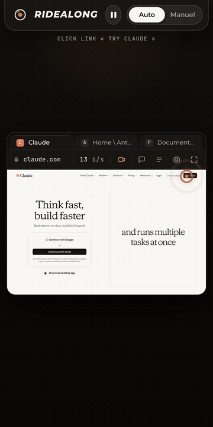

# Ridealong

*English: [README.md](README.md)*


<p align="center"></p>

Un navigateur piloté par Claude, que vous pouvez **regarder en direct** et
**reprendre en main** à tout moment. Ridealong est un serveur MCP (stdio) qui
conduit un vrai Google Chrome par CDP, et une **vue live** : page web avec
flux vidéo H.264 (ou images JPEG), curseur de Claude, journal des actions,
pause, mode Manuel (vos clics, clavier et défilement vont dans Chrome),
onglets, choix de résolution.

## Deux façons de l'utiliser

**Sur la machine que Claude pilote** (le plus simple, aucune infrastructure) :

```
git clone https://github.com/williamblaismedia-create/ridealong && cd ridealong && npm ci && npm run build
claude mcp add ridealong -- "$PWD/scripts/ridealong-local.sh"
```

Le lanceur démarre Chrome avec son port de debug, génère un secret dans
`~/ridealong-data/ridealong.env` la première fois, puis lance le serveur. Dans
Claude : « ouvre timeliner.io et donne-moi la vue live » → un lien
`http://127.0.0.1:9400/#token=…` à ouvrir dans un navigateur. `ffmpeg` sur
la machine active la vidéo (NVENC, VideoToolbox sur Mac, sinon logiciel) ;
sans ffmpeg, la vue live fonctionne en images JPEG.

**Sur un serveur toujours allumé** (Chrome sous Xvfb, tunnel Cloudflare,
relais SSH depuis le Mac) : voir `docs/DEPLOIEMENT-W-AGENT.md`.

## Exemples

Trois scénarios à copier-coller dans [`examples/`](examples/) (en anglais),
chacun avec le prompt exact, ce que vous voyez sur la vue live et où vous
intervenez :

- [**QA après déploiement**](examples/qa-after-deploy/) : rechargement sans
  cache, parcours du flux principal, lecture de `console_errors` et
  `network_requests`, rapport. Avec un extrait de `CLAUDE.md` pour le lancer
  après chaque déploiement.
- [**Achat avec approbation**](examples/approval-gated-purchase/) : Claude
  remplit le panier, `ask_approval` bloque avant « Commander », vous
  approuvez depuis votre téléphone.
- [**Passe-la-main pour la connexion**](examples/login-handoff/) : Claude
  tombe sur un login ou un 2FA, passe en Manuel, vous tapez sur votre propre
  appareil, Claude ne voit jamais les frappes.

## Outils MCP

`navigate`, `state`, `snapshot`, `find`, `read`, `screenshot`, `act`, `fill`,
`scroll`, `network_requests`, `fetch_with_session`, `tabs_list`, `tabs_open`,
`tabs_close`, `tabs_select`, `reload`, `diff`, `console_errors`, `live_start`,
`live_mode`, `live_stop`, `ask_approval`, `inbox`.

Perception, action et vue live suivent un **onglet cible** que
`tabs_select`/`tabs_open` déplacent, ou qu'un tap sur un onglet de la vue
live déplace aussi.

## Barre d'état Claude Code

Avec le relais local, `scripts/ridealong-statusline.sh` affiche le lien de la vue
live dans la barre d'état pendant qu'une session Ridealong tourne (`statusLine`
dans `~/.claude/settings.json`).

## Garanties

- **Sans capture** : en mode Manuel, rien de ce que vous tapez n'est stocké,
  journalisé ni visible par Claude (sa perception est suspendue). Les champs
  mot de passe ne remontent jamais leur valeur dans les snapshots.
- **Lien signé et expirant** pour la vue live (HMAC, 30 s à 1 h), jamais
  dans l'historique du navigateur ni dans un journal serveur.

## Variables

Voir `src/config.ts` : `SCRY_CDP_URL`, `SCRY_DATA_DIR`, `SCRY_VIEWPORT_*`,
`SCRY_LIVE_PORT`, `SCRY_LIVE_SECRET`, `SCRY_LIVE_PUBLIC_URL`,
`SCRY_LIVE_QUALITY`, `SCRY_VIDEO`, `SCRY_VIDEO_ENCODER`, `SCRY_VIDEO_KBPS`,
`SCRY_VIDEO_FPS`, `SCRY_FFMPEG`.

## Développement

`npm test` (Vitest, lance un Chromium de test), `npm run build`.


*Ridealong s'appelait Scry jusqu'au 2026-09-12 : les variables `SCRY_*`, les scripts `scry-*` et les chemins existants continuent de fonctionner.*
