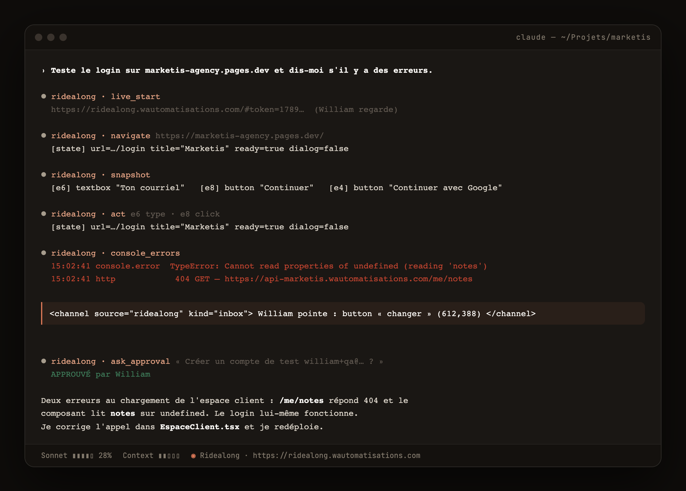
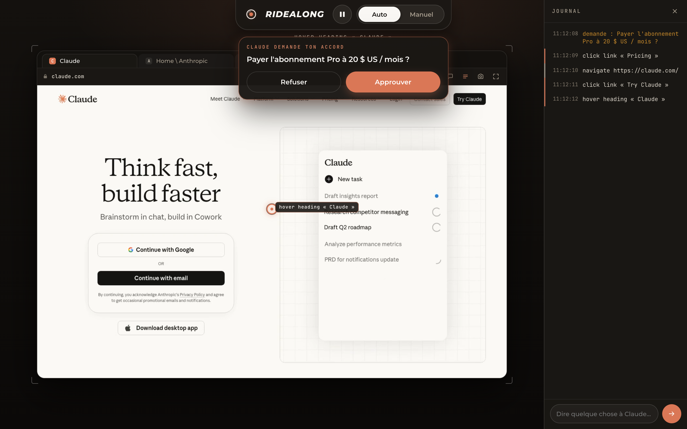
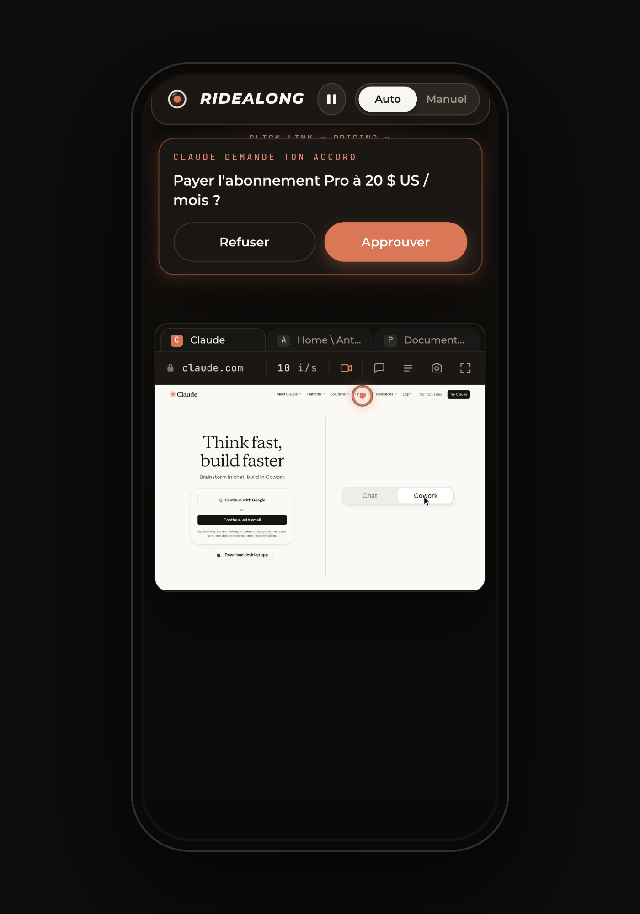
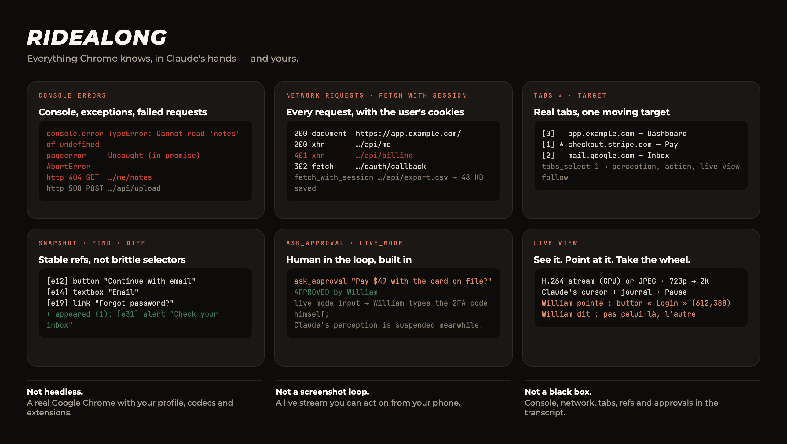

<table align="center" border="0"><tr>
  <td></td>
  <td><h1><em>RIDEALONG</em></h1></td>
</tr></table>

<p align="center">
  <strong>A browser your AI drives. Ride along, grab the wheel anytime.</strong><br>
  MCP server for Claude Code · real Google Chrome · live H.264 view · human-in-the-loop by design
</p>

<p align="center">
  <a href="https://github.com/williamblaismedia-create/ridealong/actions"></a>
  
  
  
  
</p>

<p align="center"><a href="https://williamblaismedia-create.github.io/ridealong/"><strong>Website</strong></a> · <a href="#quick-start">Quick start</a> · <a href="https://williamblaismedia-create.github.io/ridealong/fr/">Site en français</a> · <a href="README.fr.md">README en français</a></p>

<p align="center"></p>

---

Every browser MCP lets an agent click around in the dark. **Ridealong puts you
in the passenger seat.** Claude drives a real Chrome; you open one link and see exactly
what it sees, where it clicks, what it typed — and when it hits a login, a
CAPTCHA or a payment, you **take the wheel** from your phone, then hand it back.

## In Claude Code

Ridealong is an MCP server: Claude calls its tools like any other, but every
step is visible on the live view, William's pointer and messages come back
into the transcript, and sensitive actions wait for an approval.

<p align="center"></p>

## On your phone

<p align="center"><video src="https://github.com/williamblaismedia-create/ridealong/raw/main/docs/media/ridealong-phone.mp4" width="360" controls muted playsinline></video></p>

<table align="center" border="0"><tr>
<td width="62%"></td>
<td width="38%"></td>
</tr></table>

## Not just another browser MCP

<p align="center"></p>

## Why Ridealong

| | Typical browser MCP | **Ridealong** |
|---|---|---|
| Browser | headless Chromium | **real Google Chrome** (codecs, extensions, your profile) |
| Watch the agent | screenshots on request | **live stream**, GPU-encoded H.264, ~150 ms behind |
| Intervene | stop the run | **Manual mode**: your clicks, keys and scroll go straight into the page |
| Sensitive actions | hope | **`ask_approval`**: Approve / Deny on your phone, the tool waits |
| Guide the agent | type a long prompt | **tap the element** on the live view, or send a one-line message |
| Secrets | in the transcript | **never**: Manual input is not stored, logged, or visible to Claude |
| Session dies | reconnect by hand | **self-healing** relay + zombie-proof live view |

## Quick start

**On the machine Claude drives** — nothing to host:

```bash
git clone https://github.com/williamblaismedia-create/ridealong && cd ridealong && npm ci && npm run build
claude mcp add ridealong -- "$PWD/scripts/ridealong-local.sh"
```

Then, in Claude Code: *"open timeliner.io and give me the live view"*.
You get a signed link (`http://127.0.0.1:9400/#token=…`). Open it once on a
device and the bare address works for 30 days — bookmark it.

**In Docker** (Chrome under Xvfb, ffmpeg, persistent profile):

```bash
docker build -t ridealong . && claude mcp add ridealong -- docker run -i --rm -p 9400:9400 -v ridealong-data:/data ridealong
```

**On an always-on server** with an NVIDIA GPU, a Cloudflare tunnel and a
relay that survives your laptop sleeping: the reference setup is in
[`docs/DEPLOIEMENT-W-AGENT.md`](docs/DEPLOIEMENT-W-AGENT.md) (French).

`ffmpeg` installed → H.264 video (NVENC · VideoToolbox · libx264, auto-detected).
No ffmpeg → JPEG frames. Either way it works.

## What you get on the live view

- **Claude's cursor** gliding to each target, a ripple on click, the action
  label — and a **journal** with timestamps.
- **Auto | Manual** toggle. In Manual, mouse, keyboard, trackpad scroll and
  pinch are relayed; Claude's perception is suspended while you type.
- **Pause** Claude without taking control.
- **Approval cards** when Claude calls `ask_approval`.
- **Point at things** (Auto mode tap → *"William points at: button « Login »"*)
  and **message Claude** from the page. They reach Claude at the end of his
  next tool result — or **instantly**, as a Claude Code channel, if you start
  Claude with `--dangerously-load-development-channels server:ridealong`
  (also relays "took the wheel" / "paused").
- **Real tabs**: the strip mirrors Chrome; tap one to move Claude's target.
- **Resolution picker** (720p → 2K), applied live and remembered.
- Capture, fullscreen, video/JPEG switch, reconnects by itself, phone-ready.

## Tools

| Perceive | Act | Tabs | Live view |
|---|---|---|---|
| `state` `snapshot` `find` `read` | `navigate` `reload` `act` `fill` `scroll` | `tabs_list` `tabs_open` `tabs_select` `tabs_close` | `live_start` `live_mode` `live_stop` |
| `diff` `screenshot` `console_errors` | | | `ask_approval` `inbox` |
| `network_requests` `fetch_with_session` | | | |

Everything follows one **target tab**. Elements carry stable `[ref]`s from
`snapshot`/`find`, so Claude acts by reference, never by brittle selectors.
Chrome's HTTP cache and service workers are bypassed: a site you just
deployed is what Claude sees.

## How it works

```
Claude Code ──stdio──▶ ridealong (MCP) ──CDP──▶ Google Chrome
                          │
                          └─ live view ── ws ──▶ your browser / phone
                              JPEG frames, or CDP screencast → ffmpeg (GPU) → fMP4 → MSE
                              input relay ◀── Manual mode (never stored)
```

Two Claude Code sessions on one Chrome? The second follows the first as a
control client and promotes itself if the first goes away. A local relay
(`scripts/ridealong-mcp-relay.mjs`) keeps the MCP session alive across a dead SSH
link by replaying the handshake.

## Guarantees

- **No capture.** Manual-mode input is relayed straight to Chrome and never
  retained; perception tools refuse to run while you have control; password
  fields never expose values in snapshots. A test suite pins this down.
- **Signed, expiring links** (HMAC, 30 s – 1 h). Device tokens (30 days) live
  only in your browser. Rotate `RIDEALONG_LIVE_SECRET` to revoke everything.
- **Loopback by default.** The live view listens on 127.0.0.1; you choose
  how to expose it.

## Roadmap

- [ ] Session recording (video + journal as chapters)
- [ ] Adaptive bitrate for weak mobile links
- [ ] Profiles: one Chrome context per client / task, incognito
- [ ] Annotated screenshots (refs drawn on the image)
- [ ] `npx ridealong-mcp`

## Contributing

Issues and PRs welcome — see [CONTRIBUTING.md](CONTRIBUTING.md).
`npm test` runs 131 tests against a real Chromium (and ffmpeg when present).

<p align="center"><sub>Built by <a href="https://wautomatisations.com">W Automatisations</a> · Montréal · MIT</sub></p>
